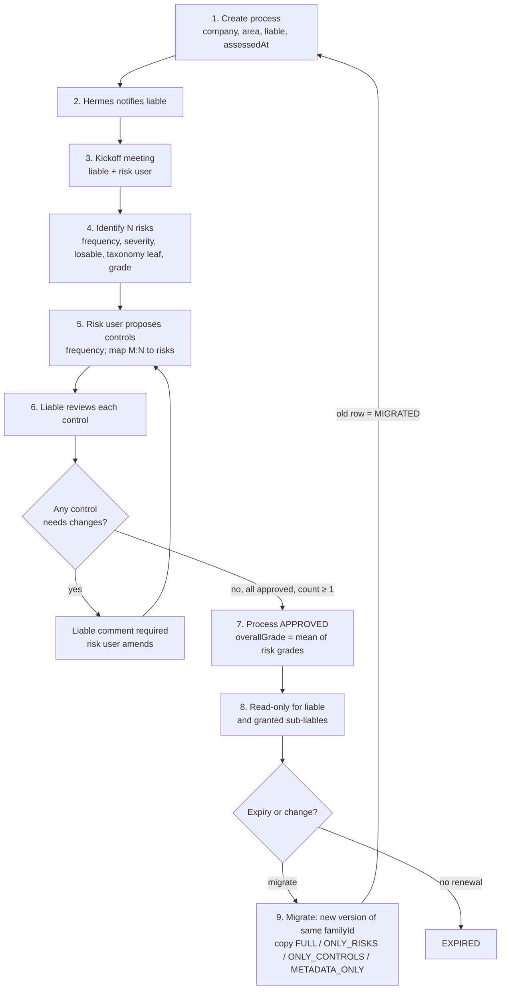
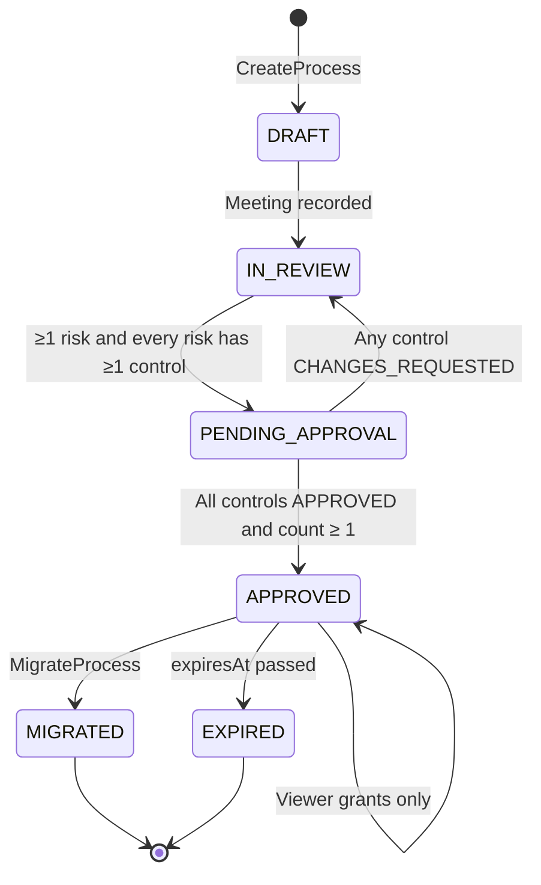

# Operational Process-Risk Workflow

Canonical decisions: [ADR-0006](file:///home/grillo/development/themis/.agents/decisions/ADR-0006-operational-process-risk-postgres.md), [ADR-0007](file:///home/grillo/development/themis/.agents/decisions/ADR-0007-authorization-membership-not-oso.md).
Design spec: `docs/superpowers/specs/2026-09-21-database-schema-grc-core-design.md`.

This is the v1 GRC workflow in `prometheus`. It is **not** the ISO/SOC 2 framework control lifecycle in `dike`.

---

## 1. Happy path

Every transition appends a `ProcessTimelineEvent` (UI) and an Astraea `AuditEvent` (hash chain).

---

## 2. State machine

A process with zero controls must not auto-approve.

---

## 3. Actors

| Actor | Source | Can approve controls? |
| :--- | :--- | :--- |
| Risk manager | `CompanyMembership` | No |
| Liable | `ProcessAssignment.kind = LIABLE` (exactly one per process) | Yes |
| Sub-liable / stakeholder / auditor | `ProcessAssignment` | No — read + timeline only |
| Company admin | `CompanyMembership.role = ADMIN` | Override only |

---

## 4. Migration

Migration is a **new version row** (`version + 1`, same `familyId`, `migratedFromId` set). The operator may change name and/or liable and must choose a copy scope. Copied controls return to `PENDING_APPROVAL`. The source row becomes `MIGRATED` and remains in the lineage log.
